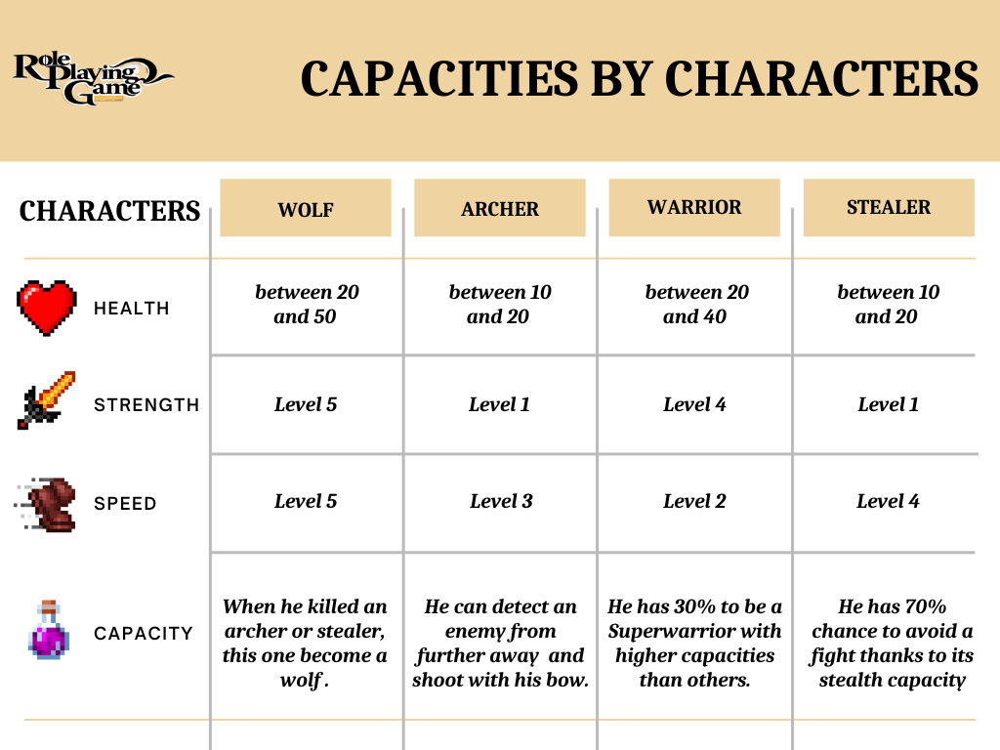

# ENGLISH-LANGUAGE VERSION
# Turn-based role-playing game: Concept

Here is the repository of a game made by me in Python.  This game is automated and is executed over 100 rounds. The game takes place on a patch of grass where different characters fight to make their community survive. You have for types of communities that are: Wolf, Warrior, Archer and Stealer. Each category has some particular aspects that you can find in the file "Capacities.png"

# Made in Python: Matplotlib & SVG

In order to make a better graphical experience, the game has been realised with the python library "Matplotlib" (documentation: https://matplotlib.org/) The patch of grass is reprensented by a graphic, and each character has his own SVG File that you can also find in the repo. Each character is actually represented by a point that moves on the graph. You can find an example of execution in the file "Simulation.png".

# Statistics: second graphic 

During the 100 rounds, you can follow the evolution of the populations thanks to a second graph that displays in real time the number of entities of each population. You can also find these numbers in your console when running the program. 

# Future Project: ".exe" and choice

My future ambition is to allow the user to choose the number of entities in each population and start the game by simply clicking on the icon,  once the python file is converted into an executable (.exe) file.

# Thanks for reading !

Contact me: slzr.tech@gmail.com

# FRENCH-LANGUAGE VERSION 

# Jeu de rôle au tour par tour : Concept

Voici le dépôt d'un jeu réalisé par mes soins en Python.  Ce jeu est automatisé et se déroule sur 100 tours. Le jeu se déroule sur une parcelle d'herbe où différents personnages se battent pour faire survivre leur communauté. Vous avez quatre types de communautés qui sont : Loup, Guerrier, Archer et Voleur. Chaque catégorie a des aspects particuliers que vous pouvez trouver dans le fichier "Capacities.png".

# Made in Python : Matplotlib & SVG

Afin de rendre l'expérience graphique plus agréable, le jeu a été réalisé avec la bibliothèque python "Matplotlib" (documentation : https://matplotlib.org/) La parcelle d'herbe est représentée par un graphique, et chaque personnage a son propre fichier SVG que vous pouvez également trouver dans le repo. Chaque personnage est en fait représenté par un point qui se déplace sur le graphique. Vous pouvez retrouver un exemple d'execution dans le fichier "Simulation.png".

# Statistiques : deuxième graphique 

Pendant les 100 tours, vous pouvez suivre l'évolution des populations grâce à un deuxième graphique qui affiche en temps réel le nombre d'entités de chaque population. Vous pouvez également retrouver ces chiffres dans votre console lors de l'exécution du programme. 

# Projet futur : ".exe" et choix

Mon ambition future est de permettre à l'utilisateur de choisir le nombre d'entités de chaque population et de lancer le jeu en cliquant simplement sur l'icône, une fois le fichier python converti en fichier exécutable (.exe).

# Merci de m'avoir lu !

Contactez-moi : slzr.tech@gmail.com
